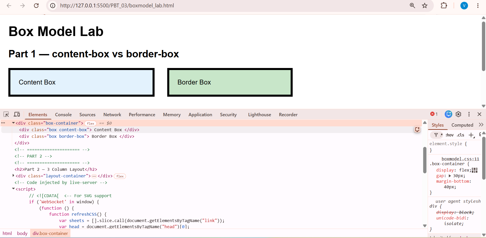
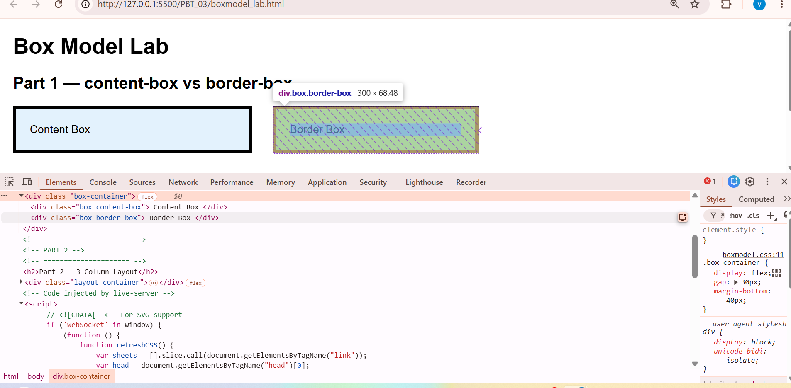
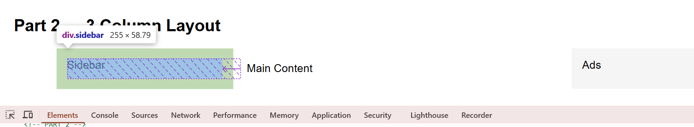
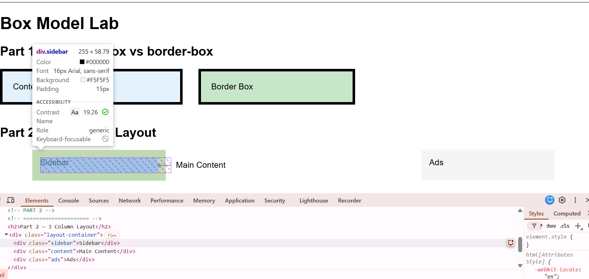

# PHẦN A — KIỂM TRA ĐỌC HIỂU (25 điểm)

## Câu A1: 3 Cách nhúng CSS vào HTML

### 1. Inline CSS (CSS trực tiếp trong thẻ)
Phương pháp này sử dụng thuộc tính `style` ngay bên trong thẻ HTML.

* **Ví dụ:**
    ```html
    <h2 style="color: red; font-size: 24px;">Đây là tiêu đề màu đỏ</h2>
    ```
* **Ưu điểm:** * Có độ ưu tiên cao nhất.
    * Tiện lợi khi muốn thay đổi nhanh một phần tử duy nhất.
* **Nhược điểm:** * Làm code HTML trở nên cồng kềnh, khó đọc.
    * Khó bảo trì vì phải tìm từng thẻ để sửa.
    * Không thể tái sử dụng định dạng cho các phần tử khác.
* **Khi nào nên dùng:** Khi cần áp dụng style riêng biệt cho một phần tử duy nhất hoặc test nhanh giao diện.

### 2. Internal CSS (CSS nội bộ)
Sử dụng thẻ `<style>` đặt bên trong thẻ `<head>` của trang HTML.

* **Ví dụ:**
    ```html
    <head>
        <style>
            body { background-color: #f4f4f4; }
            p { color: blue; line-height: 1.6; }
        </style>
    </head>
    ```
* **Ưu điểm:** * Quản lý tập trung toàn bộ style của một trang web trong một file duy nhất.
    * Có thể sử dụng các bộ chọn (class, id) để định dạng nhiều phần tử cùng lúc.
* **Nhược điểm:** * Chỉ có tác dụng trên một file HTML duy nhất. 
    * Nếu website có nhiều trang, việc lặp lại code sẽ gây lãng phí và khó cập nhật.
* **Khi nào nên dùng:** Khi làm một trang web đơn lẻ (Landing Page) hoặc khi trang đó có những định dạng hoàn toàn khác biệt với phần còn lại của website.

### 3. External CSS (CSS bên ngoài)
Viết CSS trong một file riêng biệt (đuôi `.css`) và liên kết vào HTML bằng thẻ `<link>`.

* **Ví dụ:**
    * *File `style.css`:*
        ```css
        h1 { color: darkgreen; text-align: center; }
        ```
    * *File `index.html`:*
        ```html
        <head>
            <link rel="stylesheet" type="text/css" href="style.css">
        </head>
        ```
* **Ưu điểm:** * Tách biệt hoàn toàn nội dung (HTML) và định dạng (CSS).
    * Một file CSS có thể dùng cho nhiều trang khác nhau, dễ bảo trì và nâng cấp.
    * Giúp trang web load nhanh hơn nhờ cơ chế bộ nhớ đệm (cache) của trình duyệt.
* **Nhược điểm:** Phải thực hiện thêm một yêu cầu gửi đến server để tải file CSS.
* **Khi nào nên dùng:** Đây là cách **phổ biến và tối ưu nhất** cho mọi dự án thực tế.

---

## Độ ưu tiên trong CSS

**Câu hỏi:** Nếu cùng 1 element có cả 3 cách CSS đồng thời áp dụng, cách nào "thắng"?

**Trả lời:** Cách **Inline CSS** sẽ "thắng" (có độ ưu tiên cao nhất).

**Giải thích:**
Trình duyệt quy định độ ưu tiên (Specificity) theo thứ tự giảm dần như sau:
1.  **Inline CSS** (Style trực tiếp trên thẻ) - Điểm ưu tiên cao nhất.
2.  **Internal CSS** và **External CSS** (Độ ưu tiên ngang nhau).
3.  **Mặc định của trình duyệt.**

*Lưu ý:* Nếu giữa **Internal** và **External** có xung đột, quy tắc nào được trình duyệt đọc **sau cùng** (nằm thấp hơn trong code HTML) sẽ được áp dụng. Tuy nhiên, cả hai đều sẽ bị **Inline CSS** ghi đè lên. Nếu muốn phá vỡ quy tắc này,  dùng từ khóa `!important`.  
## Câu A2: 
h1 → Chọn: Thẻ ```<h1>``` có nội dung "ShopTLU"  

.price → Áp dụng cho tất cả phần tử mang class price, gồm 2 dòng giá sản phẩm:
“25.990.000đ” và “45.990.000đ”.
#app header → Chọn thẻ <header> nằm bên trong phần tử có id app, bao gồm tiêu đề ShopTLU và toàn bộ thanh điều hướng (Home, Products, About).  

nav a:first-child → Lấy thẻ liên kết (<a>) xuất hiện đầu tiên trong menu <nav>, chính là mục “Home”.
product.featured h2 → Chọn tiêu đề <h2> thuộc sản phẩm được đánh dấu vừa có class product vừa có featured. Nội dung được chọn là “MacBook Pro”. 
- article > p → Selector này áp dụng cho các thẻ <p> là con trực tiếp của <article>. Bao gồm 4 đoạn văn:
    - Giá iPhone: 25.990.000đ
    - Mô tả iPhone
    - Giá MacBook: 45.990.000đ
    - Mô tả MacBook
a[href="/"] → Chọn: Thẻ ```<a>``` có chính xác thuộc tính href="/", nội dung "Home"  

.top-bar.dark h1 → Chọn: Thẻ ```<h1>``` nằm trong phần tử có đồng thời class top-bar và dark, có nội dung "ShopTLU"  
## Câu A3:

**Trường hợp 1: content-box (mặc định)**  
.box-1 {  
    width: 400px;  
    padding: 20px;  
    border: 5px solid black;  
    margin: 10px;  
}
1. Chiều rộng hiển thị = content + padding trái/phải + border trái/phải = 400 + 20*2 + 5*2
= 400 + 40 + 10
= 450px
2. Không gian chiếm trang = chiều rộng hiển thị + margin trái/phải = 450+10*2 = 470px

**Trường hợp 2: border-box**  
.box-2 {  
    box-sizing: border-box;  
    width: 400px;  
    padding: 20px;  
    border: 5px solid black;  
    margin: 10px;  
}
1. Chiều rộng hiển thị = 400px  (Trong border-box, width đã bao gồm content + padding + border)
2. Kích thước content = 400 - padding trái/phải - border trái/phải = 400 - 20*2 - 10*2 =  350px
3. Không gian chiếm trang = width + margin trái/phải = 400 + 10*2 = 420px

**Trường hợp 3: Margin collapse**
.box-a { margin-bottom: 25px; }  
.box-b { margin-top: 40px; }  
Khoảng cách box-a - box-b = 40px
Không phải 65px (25+40) bởi vì Browser sẽ lấy margin lớn hơn (Chúng collapse) thành một margin duy nhất  
Nhưng khi  
.box-a { margin-bottom: -10px; }  
.box-b { margin-top: 40px; }  
Khoảng cách giữa box-a với box-b là 30px bởi vì có margin âm

## Câu A4 — CSS Specificity (Độ ưu tiên)

Xét element:

<p class="price" id="main-price"></p>
1. Tính Specificity cho từng rule

Rule A

p { color: black; }
ID: 0
Class: 0
Element: 1
→ Specificity = (0,0,1)

Rule B

.price { color: blue; }
ID: 0
Class: 1
Element: 0
→ Specificity = (0,1,0)

Rule C

#main-price { color: red; }
ID: 1
Class: 0
Element: 0
→ Specificity = (1,0,0)

Rule D

p.price { color: green; }
ID: 0
Class: 1
Element: 1
→ Specificity = (0,1,1)
2. Element sẽ có màu gì? Giải thích

So sánh độ ưu tiên:

(1,0,0) > (0,1,1) > (0,1,0) > (0,0,1)

Rule C có specificity cao nhất vì chứa ID selector.

→ Màu hiển thị cuối cùng: red

3. Nếu thêm inline style
<p class="price" id="main-price" style="color: orange;">

Inline style có độ ưu tiên cao hơn các rule trong file CSS.

→ Màu hiển thị: orange

4. Nếu Rule A dùng !important
p { color: black !important; }

!important được ưu tiên hơn specificity thông thường.

→ Rule A ghi đè các rule còn lại.

→ Màu hiển thị: black

## Bài B1: Liệt kê selector đã dùng trong file profile.html
**Các loại selector đã sử dụng**

1. Element selector
- body
- table
- footer

2. ID selector
- #main-header

3. Class selector
- .profile-section
- .active

4. Descendant selector
- nav a

5. Pseudo-class selector
- a:hover
- tr:nth-child(even)
- tr:hover
## Bài B2 — Box Model Lab

---

## Phần 1 — Content-box vs Border-box

### Hộp 1 (content-box)

- Width khai báo: **300px**
- Padding: **20px × 2 = 40px**
- Border: **5px × 2 = 10px**

👉 **Chiều rộng thực tế:**

300 + 40 + 10 = **350px**



---

### Hộp 2 (border-box)

👉 **Chiều rộng thực tế:**

**300px**

Vì padding và border đã được tính bên trong thuộc tính `width`.



---

### Giải thích sự khác biệt

**content-box**

- `width` chỉ tính phần **content**
- Padding và border được cộng thêm vào kích thước thật
- Làm layout dễ bị tràn

**border-box**

- `width` bao gồm **content + padding + border**
- Kích thước thật luôn đúng bằng width khai báo
- Giúp layout dễ kiểm soát hơn

---

## Phần 2 — Layout 3 cột

### Không dùng border-box

Tổng chiều rộng thực tế:

- Sidebar: 250 + 30 + 4 = **284px**
- Content: 500 + 40 + 4 = **544px**
- Ads: 250 + 30 + 4 = **284px**

👉 Tổng:

284 + 544 + 284 = **1112px**

➡ Vượt quá container **1000px** → Layout bị tràn.



---

### Có dùng border-box

Tổng chiều rộng:

250 + 500 + 250 = **1000px**

➡ Vừa đúng container.



---

## Bài B3 — CSS Specificity

### 10 Rules + Specificity Score

1. `p` → **0,0,1**
2. `.text` → **0,1,0**
3. `.highlight` → **0,1,0**
4. `p.text` → **0,1,1**
5. `p.highlight` → **0,1,1**
6. `.text.highlight` → **0,2,0**
7. `#demo` → **1,0,0**
8. `p#demo` → **1,0,1**
9. `#demo.text` → **1,1,0**
10. `p#demo.text.highlight` → **1,2,1**

---

## Element cuối cùng hiển thị màu gì?

👉 **Màu hiển thị cuối cùng: `gold`**

Vì selector:

