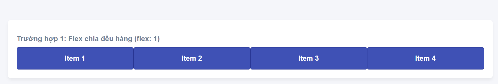
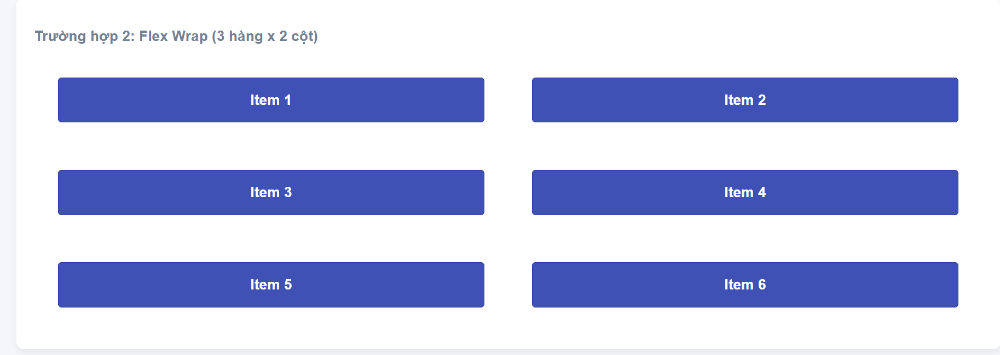
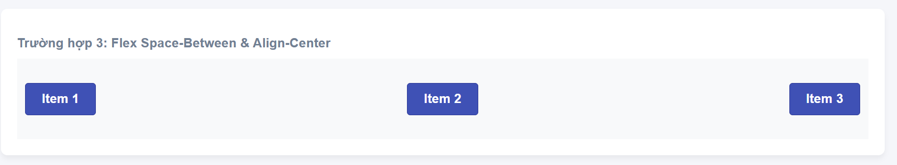
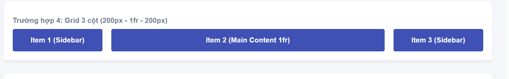
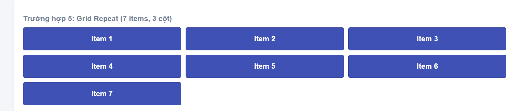

# PHẦN A — KIỂM TRA ĐỌC HIỂU

## Câu A1 — 5 Loại Positioning

| Position | Vẫn chiếm chỗ trong flow? | Tham chiếu vị trí (Mốc tọa độ) | Cuộn theo trang? | Use cases (Khi nào dùng?) |
| :--- | :--- | :--- | :--- | :--- |
| **static** | Có | Theo luồng tài liệu HTML mặc định (Normal flow). | Có | Mặc định cho mọi phần tử. Dùng khi muốn các thành phần hiển thị tuần tự bình thường từ trên xuống dưới. |
| **relative** | Có (Vẫn chiếm chỗ ở vị trí cũ trong luồng) | Vị trí ban đầu (gốc) của chính nó. | Có | Dịch chuyển nhẹ phần tử mà không làm ảnh hưởng xung quanh; hoặc làm "mỏ neo" (thẻ cha) cho thẻ con sử dụng `absolute`. |
| **absolute** | Không (Bị rút hoàn toàn khỏi luồng) | Thẻ tổ tiên gần nhất có thuộc tính `position` khác `static`. | Có | Căn chỉnh phần tử tự do (Ví dụ: nút "X" đóng cửa sổ popup, dấu chấm đỏ thông báo trên icon quả chuông). |
| **fixed** | Không | Khung nhìn của trình duyệt (Viewport). | Không (Đứng im một góc khi cuộn trang) | Thanh menu header dính ở trên cùng, nút "Back to top", bong bóng chat hỗ trợ. |
| **sticky** | Có | Lai giữa `relative` và `fixed` (Tham chiếu theo viewport nhưng bị giới hạn trong ranh giới thẻ cha). | Vừa có vừa không (Cuộn cùng trang nhưng sẽ dính lại khi chạm mốc) | Tiêu đề hàng/cột của bảng giữ cố định khi cuộn dữ liệu, thanh mục lục dính trên sidebar khi đọc bài viết dài. |

---

### Câu hỏi phụ

#### 1. Khi nào `absolute` tham chiếu `body`? Khi nào tham chiếu `parent`?
* **Tham chiếu `body` (hoặc document):** Khi phần tử `absolute` đó không nằm bên trong bất kỳ một thẻ cha hay tổ tiên nào được cài đặt thuộc tính `position` (tức là tất cả các thẻ bao bọc nó đều ở trạng thái `static` mặc định). Lúc này, nó sẽ lấy mốc tọa độ theo toàn bộ trang web.
* **Tham chiếu `parent` (hoặc tổ tiên):** Khi thẻ cha trực tiếp (hoặc một thẻ tổ tiên xa hơn bao bọc nó) được cài đặt thuộc tính `position` mang giá trị khác `static` (như `relative`, `absolute`, `fixed`, hoặc `sticky`). Cách làm phổ biến nhất trong thực tế là đặt thẻ cha là `position: relative;` để làm gốc tọa độ cho thẻ con `absolute`.

#### 2. Giải thích khái niệm "nearest positioned ancestor" (Tổ tiên được định vị gần nhất)
* Đây là quy tắc mà trình duyệt dùng để tìm kiếm mốc tọa độ để căn chỉnh cho một thẻ đang dùng `position: absolute;`.
* **Quá trình tìm kiếm:** Trình duyệt sẽ đi ngược từ vị trí của thẻ `absolute` hiện tại lên các thẻ bọc ngoài nó (tìm từ cha trực tiếp, rồi lên ông, bà, cụ...):
  * **"Positioned"** nghĩa là thẻ tổ tiên đó phải được cài đặt thuộc tính `position` khác với giá trị `static` mặc định.
  * **"Nearest"** nghĩa là trình duyệt sẽ lấy thẻ **đầu tiên** thỏa mãn điều kiện trên để làm khung tham chiếu cho các thuộc tính định vị (`top`, `right`, `bottom`, `left`).
* Nếu dò ngược lên đến tận cùng (thẻ `<html>`) mà vẫn không tìm thấy thẻ nào thỏa mãn, trình duyệt sẽ mặc định lấy toàn bộ khung nhìn trang web làm mốc.
## Câu A2 — Flexbox vs Grid

---

### /* Trường hợp 1 */
```css
.container { display: flex; }
.item { flex: 1; } /* 4 items */
``` 
Dự đoán bố cục: 4 items sẽ nằm trên 1 hàng duy nhất. Do có thuộc tính flex: 1, cả 4 items sẽ tự động co giãn và chia đều khoảng trống để có kích thước rộng bằng nhau ($25\%$ độ rộng của container mỗi item), lấp đầy toàn bộ chiều ngang container.Sơ đồ bố cục (1 hàng, 4 cột đều nhau):
- 
### Bố cục:



→ 1 hàng, 4 cột bằng nhau.


### /* Trường hợp 2 */
```css
.container { display: flex; flex-wrap: wrap; }
.item { width: 45%; margin: 2.5%; } /* 6 items */
```

- Mỗi item chiếm:
  - width = 45%
  - margin trái + phải = 5%
- Tổng = 50%

→ Mỗi hàng chứa được 2 item.

Có 6 item nên:

- 3 hàng
- 2 cột

### Bố cục:



### /* Trường hợp 3 */
```css
.container { display: flex; justify-content: space-between; align-items: center; } /* 3 items */
```
- `justify-content: space-between`
  → item đầu sát trái, item cuối sát phải, item giữa nằm giữa.
- `align-items: center`
  → các item căn giữa theo chiều dọc.

Có 3 item:


### Bố cục

 1 hàng ngang, khoảng cách đều nhau.

## Trường hợp 4

```css
.container {
    display: grid;
    grid-template-columns: 200px 1fr 200px;
    gap: 20px;
}
```

- Grid có 3 cột:
  - Cột 1 = 200px
  - Cột 2 = chiếm phần còn lại (`1fr`)
  - Cột 3 = 200px
- `gap: 20px` → khoảng cách giữa các cột.

Có 3 item nên mỗi item nằm trên 1 cột.

### Bố cục:



→ 1 hàng, 3 cột.

---

## Trường hợp 5

```css
.container {
    display: grid;
    grid-template-columns: repeat(3, 1fr);
    gap: 10px;
}
```

- `repeat(3, 1fr)` → tạo 3 cột bằng nhau.
- Có 7 item.

Cách sắp xếp:

- Hàng 1: item 1 2 3
- Hàng 2: item 4 5 6
- Hàng 3: item 7

### Bố cục:



→ Tổng cộng:
- 3 hàng
- 3 cột
- Item 7 nằm ở hàng cuối, cột đầu tiên.